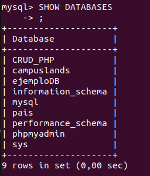
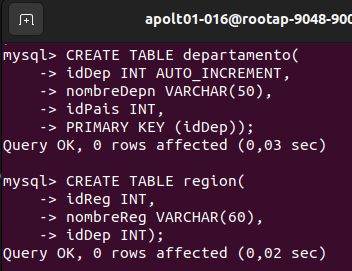
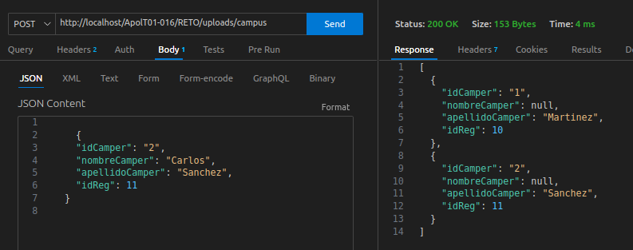

***CREACION DE TABLAS CON LA TERMINAL:***

primero debemos crear la base de datos local:

empezamos con el comando en la consola=mysql -u campus -p

contraseña= campus2023

primero debimos borrar una base de datos anterior que se llamaba igual a la nuestra, con el comando Drop,

verificamos que se haya creafdo nuestra base de datos:

luego creamos la base de datos con el comando CREATE DATABASE campuslands;

luego creamos cada tabla:

-Con el comando USE campuslands le ordenamos que use nuestra base de datos para la posterior creacion de las tablas

-Con el comando CREATE TABLE pais Creamos la tabla 1

-luego la tabla 2 y 3:

y por ultimo la tabla 4:

__________________________________________________________________________________________________________________________________

***PRUEBA DE CRUD CON THUNDER CLIENT:***

Con la solicitud GET y el endpoint campus obtenemos los datos de la tabla campers:

Con la solicitud DELETE y el idCamper eliminamos uno de nuestros campers:

Con la solicitud POST INGRESAMOS la informacion:

con la solicitud PUT editamos:

